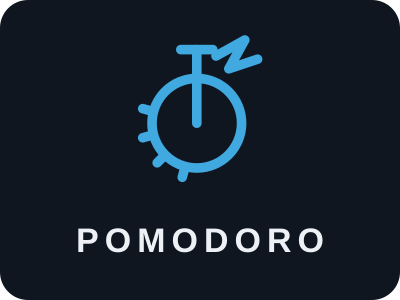
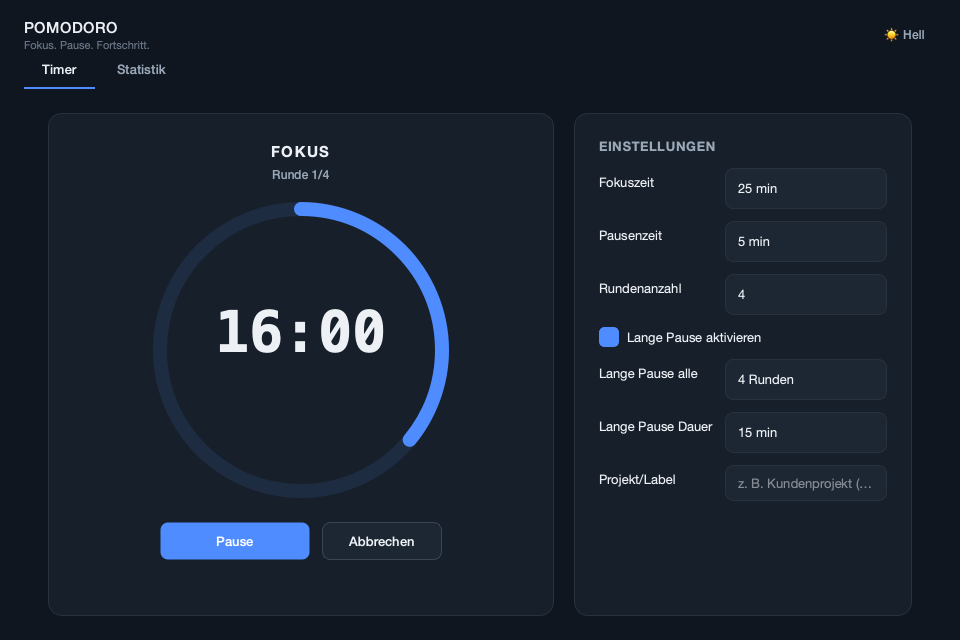
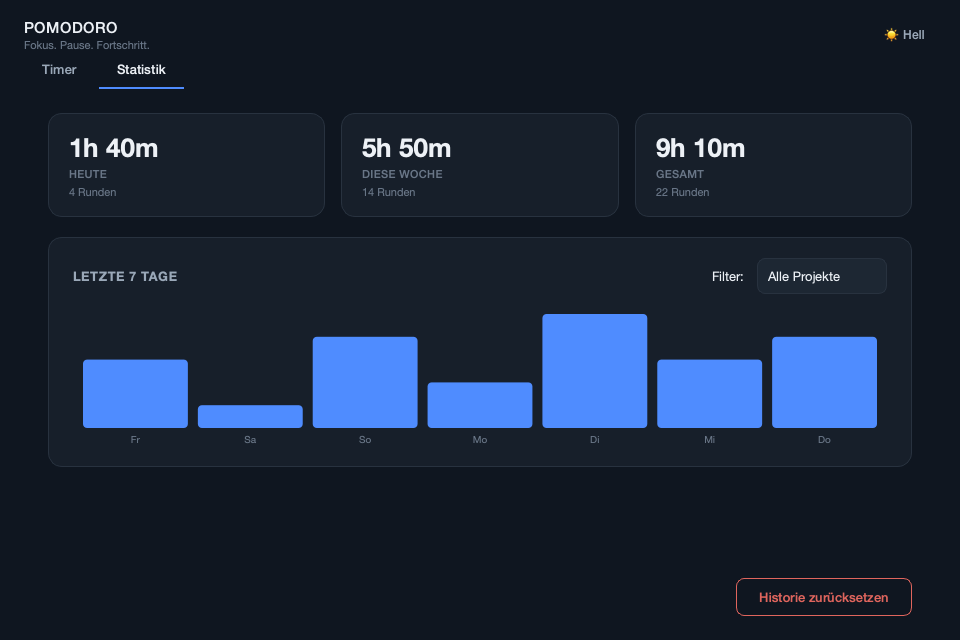

<div align="center">



**A focused time‑management app for macOS — structured work sessions, deliberate breaks, and a clear picture of where your hours actually go.**

[](#getting-started)
[](pyproject.toml)
[](https://doc.qt.io/qtforpython/)
[](LICENSE)



</div>

---

## Overview

Pomodoro turns the well‑known **Pomodoro Technique** into a calm, native desktop
app. Set the length of your focus and break intervals, press **Start**, and the
app walks you through alternating focus and break rounds with a live countdown,
audio cues, and macOS notifications.

Every focus round you complete is logged locally, so the **Statistics** view can
show how much focused time you genuinely put in — today, this week, and all‑time,
optionally broken down by project.

It is intentionally small and single‑purpose: **no account, no cloud, no
telemetry.** Your configuration and history never leave your Mac.

## Highlights

|  |  |
| --- | --- |
| **Structured sessions** | Configurable focus, break and long‑break durations plus round count. A session always begins and ends on a focus round — never on a break. |
| **Distraction‑resistant timer** | A large animated progress ring with an `mm:ss` countdown. Timer settings lock while a round is running so an in‑progress session can't be derailed by accident. |
| **Focus analytics** | Today / this‑week / all‑time totals, completed‑round counts, and a 7‑day bar chart — all filterable by project tag. |
| **Audio & notification cues** | Distinct sounds at the end of focus rounds and breaks, plus optional macOS notifications on every phase change. |
| **Local‑first & private** | Settings and history live in a single folder under `~/Library/Application Support`. Nothing is transmitted anywhere. |
| **Native & self‑contained** | Ships as a `Pomodoro.app` bundle with its own Python and Qt runtime — nothing to install, launches from the Dock, Spotlight or Launchpad. |
| **Considered design** | A deliberate two‑colour system (calm blue for focus, restorative green for breaks) defined once as design tokens and applied consistently, with a light and a dark theme. |

## The Pomodoro Technique

The technique is a simple, research‑friendly way to protect attention: work in
fixed, uninterrupted intervals — traditionally **25 minutes** — each followed by
a short break, with a longer break after every few intervals. The fixed length
lowers the barrier to starting, the breaks keep fatigue from compounding, and the
count of completed intervals becomes an honest measure of a day's focused work.

Pomodoro keeps that structure but makes every part adjustable: interval lengths,
how many rounds make up a session, and whether (and how often) a long break is
inserted.

## Screenshots

| Focus session | Statistics |
| --- | --- |
|  |  |

## Getting started

### Option A — install the macOS app (recommended)

Build a self‑contained `Pomodoro.app` with [PyInstaller](https://pyinstaller.org/):

```bash
git clone https://github.com/l3monKenji/pomodoro.git
cd pomodoro
python3 -m venv .venv && source .venv/bin/activate
./packaging/build.sh
```

`build.sh` installs the build dependency, renders the app icon, runs PyInstaller
against [`packaging/Pomodoro.spec`](packaging/Pomodoro.spec), and ad‑hoc
code‑signs the result (required on Apple Silicon). Then install it:

```bash
cp -R dist/Pomodoro.app /Applications/
open /Applications/Pomodoro.app
```

The bundle ships its own Python and Qt, so it runs on any Mac (macOS 11 or
newer) with no Python installed. Add `--dmg` to also produce a
`dist/Pomodoro.dmg` for moving it to another machine:

```bash
./packaging/build.sh --dmg
```

> The app is not signed with an Apple Developer ID. On the Mac that built it, it
> opens normally. On a different Mac, the first launch needs a right‑click →
> **Open** (or *System Settings → Privacy & Security → Open Anyway*) to clear
> Gatekeeper.

### Option B — run from source

Requires Python 3.10 or newer on macOS.

```bash
git clone https://github.com/l3monKenji/pomodoro.git
cd pomodoro
python3 -m venv .venv && source .venv/bin/activate
pip install -e .
pomodoro           # or: python -m pomodoro
```

`pip install -e .` registers the `pomodoro` console command, which opens the
same window as the bundled app.

## Using Pomodoro

1. In **Einstellungen** (Settings), set your focus and break lengths, the number
   of rounds, and — if you want one — the long break and its interval.
2. Optionally enter a **project / label** so the session is attributed to a piece
   of work in your statistics.
3. Press **Start**. The ring counts the current phase down; use
   **Pause / Fortsetzen** to hold it and **Abbrechen** to reset.
4. The app advances through focus and break rounds automatically, signalling each
   transition with a sound and a notification, and finishes on the last focus
   round.
5. Open the **Statistik** tab at any time for your totals and the 7‑day chart.

Only **fully completed** focus rounds are recorded — cancelling a round mid‑way
simply leaves it uncounted, so the statistics stay honest.

## Focus analytics

The **Statistik** tab aggregates your completed focus rounds into:

- **Today**, **this week** (from Monday), and **all‑time** totals, each with a
  completed‑round count.
- A **7‑day bar chart** of focused minutes per day.
- A **project filter** — pick a tag to scope every number and the chart to a
  single piece of work.

History can be wiped from the same tab (**Historie zurücksetzen**); it asks for
confirmation first because the action can't be undone.

## Sounds & notifications

Pomodoro plays a short MP3 at the end of every focus round and every break, using
macOS's built‑in `afplay` (no extra audio dependency). Provide your own files
with these exact names:

| File | Played when… |
| --- | --- |
| `focus_end.mp3` | a focus round finishes |
| `break_end.mp3` | a short or long break finishes |

- **From source:** drop them into [`sounds/`](sounds/).
- **In the packaged app:** drop them into
  `~/Library/Application Support/Pomodoro/sounds/` — that location is checked
  first and overrides whatever was bundled at build time.
- The lookup folder can also be set explicitly via the `POMODORO_SOUNDS_DIR`
  environment variable.

No MP3s ship in this repository (see [`sounds/README.md`](sounds/README.md)).
Without them nothing breaks — the app falls back to a system beep and shows a
one‑line hint in the window. Notifications are best‑effort and silently skip
themselves if macOS won't display them.

## Data, storage & privacy

Everything the app persists lives in one folder:

```
~/Library/Application Support/Pomodoro/
├── settings.json   # last‑used timer configuration, theme, project tag
├── pomodoro.db     # SQLite log of completed focus rounds
└── sounds/         # optional user‑supplied focus_end.mp3 / break_end.mp3
```

Each completed focus round is appended to `pomodoro.db` with its timestamp,
duration and optional project tag — that single table is the entire data model
behind the statistics. Nothing is sent over the network; there is no analytics or
crash reporting.

## Settings reference

| Setting | Default | Range | Notes |
| --- | --- | --- | --- |
| Fokuszeit (focus) | 25 min | 1–180 | Length of each focus round. |
| Pausenzeit (short break) | 5 min | 1–60 | Break after a normal focus round. |
| Rundenanzahl (rounds) | 4 | 1–12 | Focus rounds per session. |
| Lange Pause aktivieren | on | — | Whether a long break replaces a short one periodically. |
| Lange Pause alle | 4 rounds | 2–10 | Insert a long break after every _n_ focus rounds. |
| Lange Pause Dauer | 15 min | 5–60 | Length of the long break. |
| Projekt / Label | — | free text | Tag attached to rounds completed in this session. |

Changes are saved automatically and restored on the next launch.

## Architecture

```
src/pomodoro/
├── core/          # timer.py — pure-Python Focus/Break/rounds state machine
├── persistence/   # settings.py (JSON) · history.py (SQLite) · paths.py
├── audio/         # player.py (afplay) · notifications.py (osascript)
├── gui/           # PySide6 window: theme tokens, custom widgets, timer & stats tabs
├── cli.py         # `pomodoro` entry point
└── __main__.py    # `python -m pomodoro`
tests/             # unit tests for the timer state machine
sounds/            # drop-in folder for focus_end.mp3 / break_end.mp3
packaging/         # PyInstaller spec, icon generator, build.sh → Pomodoro.app
```

The timer logic in [`core/timer.py`](src/pomodoro/core/timer.py) has **no Qt
dependency** and is fully unit‑tested. It advances only when something calls
`TimerEngine.tick(delta_seconds)`; the GUI does this from a `QTimer`, which keeps
the countdown off the UI thread and makes the engine trivial to test against
simulated time. All colours, spacing and typography are design tokens in
[`gui/theme.py`](src/pomodoro/gui/theme.py), so the entire look retunes from one
file.

## Development

```bash
pip install -e ".[dev]"      # test dependencies
pytest                       # run the suite

pip install -e ".[package]"  # packaging dependencies (PyInstaller)
./packaging/build.sh         # build Pomodoro.app
```

## License

MIT — see [LICENSE](LICENSE).
